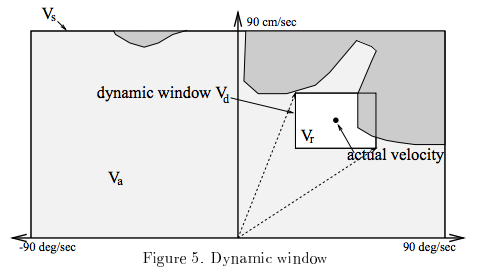
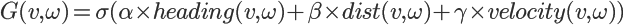

# **Dynamic Window Approach Tutorial（DWA）**
このチュートリアルではDynamic Window Approachについて学びます．

## **About DWA**
- 現在の位置情報
- 現在の速度情報
- ロボット周辺の障害物情報
- ゴールの位置情報

以上の情報から，ロボットの運動モデルに則した制御入力を計算する検索ベースのローカル経路生成アルゴリズムである．

### Algorithm Details
#### Ⅰ. Calculation of Dynamic WIndow
Dynamic Windowとは，次の時刻にロボットが実施できる制御入力の範囲のことであり，3種類のWindow(制御入力の範囲)のANDを取ったものになる．  

<div align="center">



</div>

- Window 1：制御可能範囲

        * 上図のVsに対応
        * ロボットが取りうる制御入力の最大値と最小値の範囲
        * ロボットの最大速度や最大回転速度の値を用いる

- Window 2: 動的制御可能範囲

        * 上図のVrに対応
        * 現在の速度と，スペック上での最大加減速度を元に計算された次の時刻までに取りうる最大最小の制御入力
        * 最大加減速を考慮することで、ロボットのスペックに応じた制御入力を探索することが可能

- Window 3：障害物による許容制御入力

        * 上図のVaに対応
        * 障害物センサによる観測結果と，ロボットの最大減速度の値から計算される，安全に走行できる制御入力の範囲

3種類のWindow(制御入力の範囲)の重なる部分の制御入力の範囲のみが安全で、かつ、ロボットの運動モデルを考慮した制御入力となる．  

#### Ⅱ. Optimization of the evaluation function
1. Dynamic Windowの制御範囲をある一定値毎にサンプリング  
    
        * サンプリング値（経路候補）は，ロボットが制御可能な制御解像度を与える
        * 解像度（サンプリング幅）を小さくし過ぎると，計算コストが増大するので注意が必要

2. それぞれのサンプリング制御値（経路候補）に関して評価関数（コスト関数）を計算

<div align="center">



</div>

- heading(v,ω)：方向項

        * 制御入力の時のロボットの方位とゴール方向の差の角度を180度から引いた値
        * ロボットがゴールに真っ直ぐ向かっている場合は，方向項の値は大きくなる

- dist(v,ω)：障害物距離項

        * 制御入力の時の最近傍の障害物までの距離の値
        * 障害物から遠い制御入力の障害物距離項の値が大きくなる

- velocity(v,ω)：速度項

        * 制御入力のv（並進速度）の値
        * 速度が早い制御入力の速度項の値が大きくなる

- α、β、γ：重みパラメータ

        * それぞれの項の線形足しあわせの重みパラメータ
        * パラメータを調整することにより，ゴールに向かいつつ，障害物を避けながら，高速に走ることが可能

- σ：スムージング関数

        * 制御入力が近いサンプリング値の評価値の平均や正規化などをとって，滑らかにさせるための関数

それぞれの制御サンプリング値に対して，この評価値（コスト）を計算し，その中で一番評価値が大きい制御入力を最適値（最適経路）として採用

### Advantages and disadvantages of DWA
#### Advantages
- 高速な計算が可能 (10ms以下)
- 車両モデルを取り入れることができる
- パラメータをチューニングしやすい
- Global Dynamic Window approachを使えば、局所コースに陥らずにすむ

#### Disadvantages
- 通常のDWAのアルゴリズムでは、局所コースに陥ってしまう
- 一定制御入力という仮定があるため、複雑な走行ができない

## **Program description**
### PathGenerator
DWAを行うためのデータをサブスクライブし，経路生成を行う．

- path_generator（[.cpp](src/path_generator/path_generator.cpp)）
    - DWAを行うためのデータをサブスクライブし，dynamic_window_approachに値を渡す．
- dynamic_window_approach（[.h](include/dwa_tutorial/dynamic_window_approach.h)，[.cpp](src/path_generator/dynamic_window_approach.cpp)）
    - path_generatorから受け取った値からDWAによる経路生成を行う

### WaypointAction
WaypointActionによりDWAを用いた経路生成のデモストレーションを行う

- client
    -  WaypointActionのClient
        - waypoint_client（[.cpp](src/waypoint_action/client/waypoint_client.cpp)）
    
- server
    - WaypointActionのServer
        - waypoint_server（[.cpp](src/waypoint_action/server/waypoint_server.cpp)）
    - DWAに必要な情報を扱う
        - dwa_calculation_data_handle（[.h](include/dwa_tutorial/dwa_calculation_data_handle.h)，[.cpp](src/waypoint_action/server/dwa_calculation_data_handle.cpp)）

- virtual_environment
    - デモストレーションのための仮想環境の生成
        - virtual_environment（[.cpp](src/waypoint_action/virtual_environment/virtual_environment.cpp)）
    - ロボットの位置座標情報を扱う
        - robot_pose_broadcaster（[.cpp](src/waypoint_action/virtual_environment/robot_pose_broadcaster.cpp)）
        
#### How to Demonstrate
1. PathGeneratorの起動
```bash
$ roslaunch dwa_tutorial path_generator.launch 
```
経路が生成されると，経路情報が出力される  

2. WaypointActionの起動
- serverの起動
```bash
$ roslaunch dwa_tutorial waypoint_action_server.launch 
```
経路生成が開始されると，目的地までの残りの距離を出力  

- clientの起動
```bash
$ roslaunch dwa_tutorial waypoint_action_client.launch 
```
経路生成が開始されると，serverからのfeedback情報を出力  

rvizの2D New Goalで目的地を選択すると，経路生成が開始される．

<div align="center">

  

・緑の円：障害物の位置  
・赤の円：障害物のコスト  
・青の丸：目的地の位置  
・緑の線：予測された経路の候補  
・赤の線：障害物にぶつかる経路  
・青の線：選択された経路  
</div>

# **Reference** 
- [The Dynamic Window Approach to Collision Avoidance](https://www.researchgate.net/publication/3344494_The_Dynamic_Window_Approach_to_Collision_Avoidance)  
- [Dynamic Window Approachを利用したMotion planningのMATLAB, Python サンプルプログラム](https://myenigma.hatenablog.com/entry/20140624/1403618922)  
