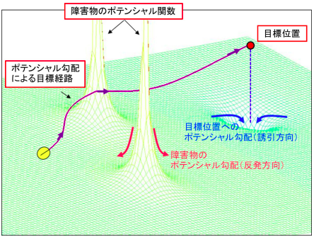
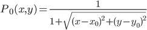
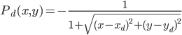

# Potential Method
このチュートリアルではPotential Methodについて学びます．

## About Potential Method
### ＊ ポテンシャル法
障害物と目標位置の座標にポテンシャル関数と呼ばれる関数を定義し，その関数の勾配（座標成分ごとの偏微分）から進むべき方向を導出する手法である．  

### ＊ ポテンシャル関数
障害物に対しては正無限大，目標位置に対しては負無限大に発散するような滑らかな関数を定義する．  
障害物に定義した関数の勾配は，障害物から離れる方向であり，目標位置に定義した関数の勾配は，逆に接近する方向となる．  
この関数群の重ね合わせがポテンシャル場となり，ポテンシャル場の勾配（微分）は，障害物から離れ，かつ目標位置へ接近する方向となる．  

障害物を回避しながら目標位置へ向かうには，この勾配をその時点でのロボットの目標方向とすれば良い．

<div align="center">


(1)式：障害物に対してのポテンシャル関数，(2)式：目標位置に対してポテンシャル関数，(3)式：ポテンシャル場，(4)式：ポテンシャル場の勾配
</div>

### ＊ ポテンシャル法の特徴  
1. その時点での情報に従って目標方向を導出するため，地形マップ等の事前情報が不要である．  
2. 障害物を発見した時点でポテンシャル場が変化するため，リアルタイムに目標経路を変更できる．  
3. ｘ，ｙ，…等の座標成分別に勾配を導出するため，三次元空間への適用が容易に行える．  

<div align="center">



</div>

## Program description
### ＊ PathGenerator
生成するためのセンサーデータなどを取得やその情報から経路を生成するプログラム[(コード)](src/path_generator.cpp)

#### 2つのクラス
* MySubscribers  
    センサー情報やオドメトリをサブスクライブするクラス．  

* PathGenerator  
    MySubscribersクラスを継承したクラスでセンサー情報やオドメトリをPotentialMethodクラスの関数に与えることで経路生成を行う．  

### ＊ PotentialMethod
ポテンシャル場の生成やポテンシャル法による経路を生成するプログラム[(宣言](include/potential_method/potential_method.h)，[定義)](src/potential_method.cpp)，

### ポテンシャル関数
ポテンシャルの最大値と最小値をそれぞれ1,-1とするため以下の式にした．
<div align="center">

  


</div>


## How to Use
```bash
$ roslaunch potential_method path_generator.launch
```

rvizの2D Nav Goalで目標位置を決定すると，経路生成を開始します．  


# Reference 
[ポテンシャル法によるロボット製品の障害物回避技術の開発](https://www.mhi.co.jp/technology/review/pdf/511/511040.pdf)